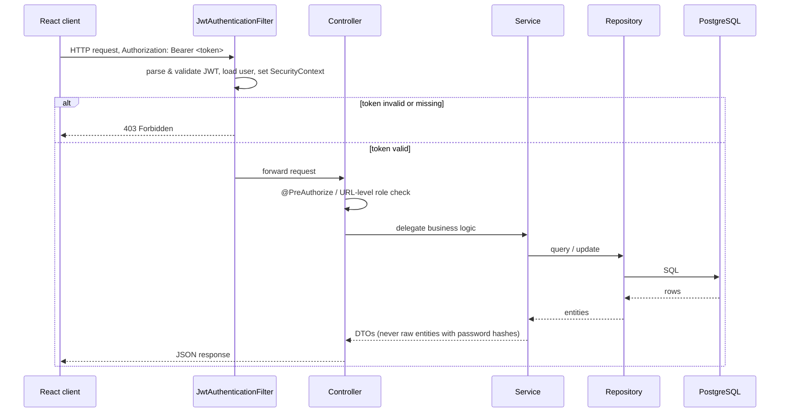

# IdentitySoft

[](https://github.com/Royniel/IdentitySoft/actions/workflows/ci.yml)

## Problem statement

Most auth demos stop at "login works." Real identity systems have to answer harder questions:
who can promote someone else to admin, what happens when the only admin tries to demote
themselves, how do you reset a password without a working email service, and how do you prove
any of that actually works instead of just looking like it does. IdentitySoft is a small
full-stack app built around those questions — JWT authentication, role-based access control, and
a self-service admin panel with guards against locking everyone out, backed by a real test suite
and a real containerized deployment.

## What this demonstrates

- **REST API design** — layered architecture (controller → service → repository), DTOs that
  never leak password hashes, consistent error responses via a global exception handler.
- **Authentication & authorization** — stateless JWT (access + refresh tokens), BCrypt password
  hashing, method- and URL-level RBAC, and a "last admin" guard so self-service role changes
  can't accidentally leave the system with zero admins.
- **Testing** — JUnit 5 + Mockito unit tests for the service layer, plus integration tests that
  exercise the real Spring Security filter chain against a real Postgres instance via
  Testcontainers.
- **Containerization** — a multi-stage Dockerfile and a `docker-compose.yml` that brings up the
  API and database together, healthchecked, with a seeded admin account.
- **CI** — GitHub Actions runs the backend test suite, the frontend build, and a Docker image
  build on every push and pull request.
- **API documentation** — a live, interactive OpenAPI/Swagger UI, with the JWT bearer scheme
  wired up so you can authenticate and try protected endpoints directly from the browser.
- **A React + TypeScript frontend** — typed API client, typed auth context, typed component
  props, incrementally migrated from JavaScript.

## Demo


<table>
<tr>
<td></td>
<td></td>
<td></td>
</tr>
<tr>
<td align="center">Login — with show/hide password and demo admin credentials</td>
<td align="center">Dashboard — admin panel entry is disabled for non-admins</td>
<td align="center">Admin panel — promote, delete, and self-demote controls</td>
</tr>
</table>

## Tech stack

React 19 + TypeScript + Vite + Tailwind (frontend) · Spring Boot 4 + Spring Security + JWT
(backend) · PostgreSQL (database) · Testcontainers + JUnit 5 + Mockito (testing) · Docker +
Docker Compose · GitHub Actions · springdoc-openapi (API docs)

```
IdentitySoft/
├── frontend/       React + TypeScript + Vite app
├── identitysoft/   Spring Boot API
└── docker-compose.yml
```

## Architecture

Request flow for an authenticated call (e.g. an admin listing users):



## Quickstart (Docker Compose)

The fastest way to get a running API + database:

```bash
git clone https://github.com/Royniel/IdentitySoft.git
cd IdentitySoft
cp .env.example .env
docker compose up --build
```

Wait for both services to report `healthy` (`docker compose ps`), then:

- Explore the API directly at **http://localhost:8080/swagger-ui.html** — no frontend needed.
- Or log in as the seeded admin: username `Nilanjan`, password `Admin@123` (both configurable in
  `.env` via `SEED_ADMIN_*`).

Once images are cached, `docker compose up` itself takes well under a minute — the first build
is slower since Docker has to pull base images and download Maven dependencies.

This starts the **backend + Postgres only**. To also run the React frontend against it:

```bash
cd frontend
npm install
npm run dev
```

Then open **http://localhost:5173**.

## Manual setup (without Docker)

If you'd rather run everything natively:

<details>
<summary>Expand for the manual setup steps</summary>

### Prerequisites

| Tool | Version used | Check with |
|---|---|---|
| Java (JDK) | 17+ | `java -version` |
| Node.js | 18+ | `node -v` |
| npm | 9+ | `npm -v` |
| PostgreSQL | 14+ | `psql --version` |

Maven doesn't need to be installed separately — the project includes the Maven Wrapper (`./mvnw`).

On macOS, if you don't have PostgreSQL yet:

```bash
brew install postgresql@16
brew services start postgresql@16
```

### 1. Set up the database

The backend expects a database `identity_db` owned by a user `identity_user` by default (see
`identitysoft/src/main/resources/application.properties` — every value there can be overridden
via environment variables, e.g. `DB_HOST`, `DB_USERNAME`, `JWT_SECRET`; see `.env.example`).

```bash
psql postgres -c "CREATE USER identity_user WITH PASSWORD 'identity_pass';"
psql postgres -c "CREATE DATABASE identity_db OWNER identity_user;"
```

Tables are created automatically on first run (`spring.jpa.hibernate.ddl-auto=update`).

### 2. Start the backend

```bash
cd identitysoft
./mvnw spring-boot:run
```

Wait for `Started IdentitysoftApplication in ... seconds`. First run downloads dependencies and
can take a couple of minutes; later runs are fast. The API is now at `http://localhost:8080`.

### 3. Start the frontend

In a new terminal:

```bash
cd frontend
npm install
npm run dev
```

The app is now at **http://localhost:5173**.

### 4. Log in

Register a new account, or use the demo admin: username `Nilanjan`, password `Admin@123`
(created by `AdminSeeder` on first startup if the `users` table is empty).

</details>

## Security model

- **Authentication:** stateless JWT — a short-lived access token (15 min by default) and a
  longer-lived refresh token (7 days), both HMAC-signed. Passwords are hashed with BCrypt and
  never returned by any endpoint (DTOs, not raw entities, cross the API boundary).
- **Authorization:** role-based, enforced at two layers — URL-level
  (`authorizeHttpRequests`/`hasAuthority`) and method-level (`@PreAuthorize` on `AdminController`).
  `JwtAuthenticationFilter` parses the token and populates the `SecurityContext` on every request;
  malformed or expired tokens are caught and treated as unauthenticated rather than crashing the
  request.
- **Self-service admin guards:** an admin can promote other users, delete users, or give up their
  own admin access — but `AdminService` blocks deleting or self-demoting the *last* remaining
  admin, so the system can't be locked out of its own admin panel.
- **No account enumeration:** login failures (wrong password, disabled account, unknown username)
  all return the same generic message and are logged the same way, so a client can't distinguish
  "wrong password" from "account doesn't exist."
- **Secrets:** JWT secret, DB credentials, CORS origins, and seed-admin credentials are all
  environment-variable driven (see `.env.example`) — nothing sensitive is required to be
  hardcoded to run the app.

## Data model

- **User** — id, username, email, password (BCrypt hash), active flag, roles.
- **Role** — enum, `ROLE_USER` / `ROLE_ADMIN`; a user can hold both.
- **AuditLog** — id, username, action (`LOGIN_SUCCESS`, `LOGIN_FAILURE`, `MAKE_ADMIN`,
  `USER_DELETED`, `SELF_REMOVE_ADMIN`, `PASSWORD_RESET`, ...), timestamp — a simple append-only
  trail, viewable per-user from the admin panel.

## Testing approach

Two layers, chosen to be meaningful rather than to pad a coverage number:

- **Unit tests** (JUnit 5 + Mockito) for the service layer — the auth flow (register, login,
  refresh) including failure cases like invalid credentials and an expired token, and the admin
  role-assignment/last-admin guards in both their blocked and allowed branches.
- **Integration tests** (`@SpringBootTest` + MockMvc + Testcontainers) that hit real endpoints
  through the actual Spring Security filter chain against a real Postgres container — an admin
  token succeeding, a non-admin token getting a 403, no token getting a 403, and a malformed
  token being rejected cleanly instead of crashing the server.

Run them with `./mvnw test` (needs Docker, for the Testcontainers-backed tests) or see them run
automatically in CI on every push/PR.

## API documentation

Interactive Swagger UI: **`/swagger-ui.html`** (raw OpenAPI JSON at `/v3/api-docs`). Endpoints
that require a token show a lock icon; click **Authorize** and paste the `accessToken` from
`/api/auth/login` to try them directly from the browser.

## Known limitations / what I'd do differently at scale

Being direct about the rough edges rather than hiding them:

- **`AuthService.refresh()` doesn't cleanly handle an actually-expired/malformed refresh token** —
  it escapes as an unhandled `JwtException` (500) instead of the intended `IllegalArgumentException`
  → clean 400. Caught by a test (`AuthServiceTest`), documented rather than silently patched.
- **The "last admin" guard doesn't check `active` status** — a *deactivated* admin still counts
  as a safety net, so it's theoretically possible to end up with zero admins who can actually log
  in. Fine for a demo; I'd tighten this before using the pattern for anything real.
- **No refresh-token revocation.** Tokens are stateless and valid until they expire — there's no
  server-side blacklist, so logging out doesn't actually invalidate a refresh token that's already
  been issued. At scale I'd add a revocation store (Redis, short TTL) or move to rotating refresh
  tokens.
- **No rate limiting** on login or forgot-password — both are unlimited-attempt endpoints today.
  A real deployment needs throttling to make credential stuffing and password-reset abuse
  impractical.
- **No pagination** on the admin user list or audit log — fine at demo scale, would need it
  quickly with a real user base.
- **Frontend has no test suite.** The TypeScript migration adds compile-time safety, but there's
  no Jest/Vitest coverage for components or the API client.
- **Docker Compose only containerizes the backend + Postgres**, not the frontend — intentional
  for this project's scope, but a production setup would containerize (or statically host) the
  frontend too.
