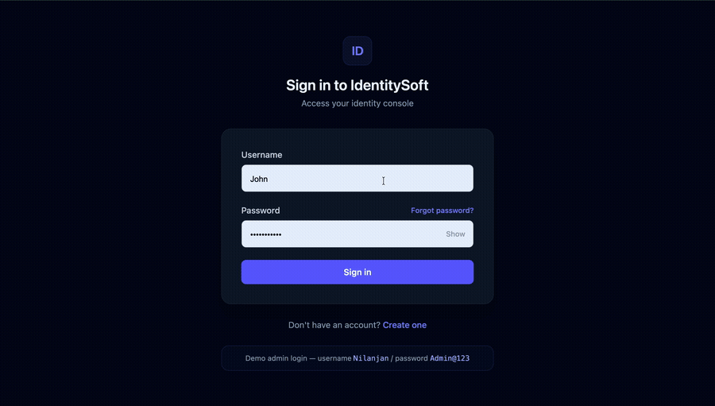
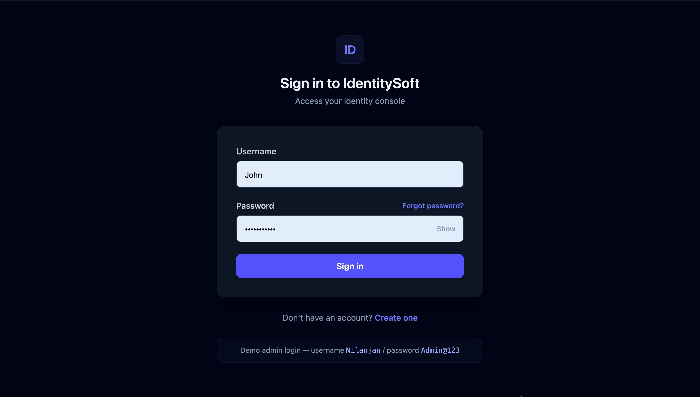
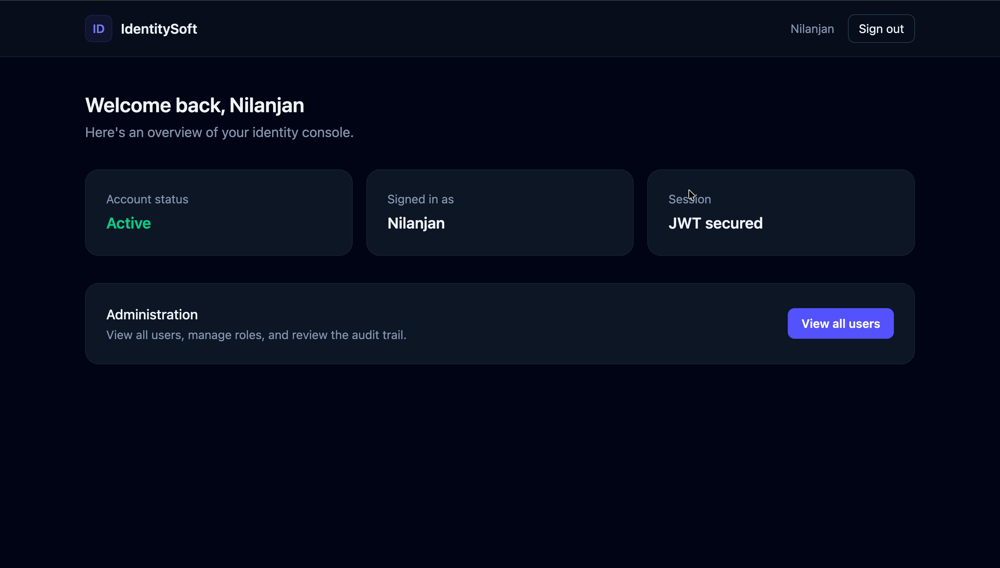
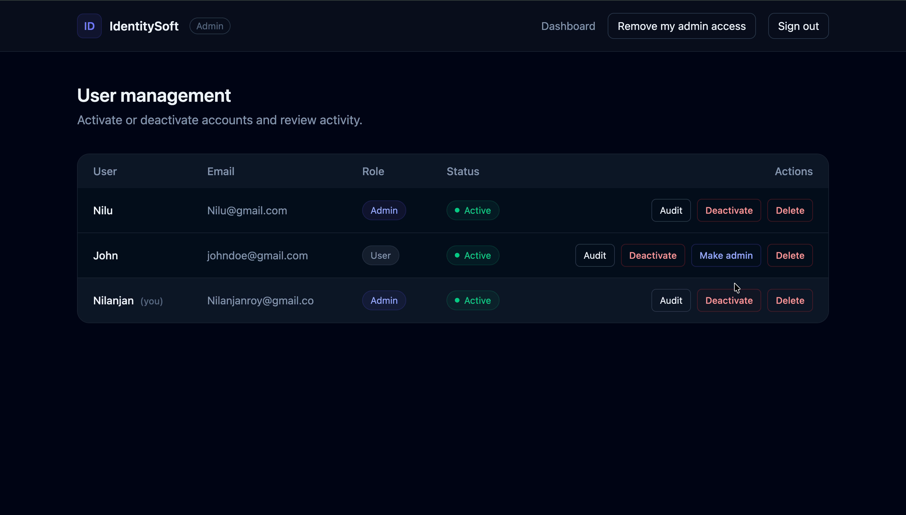

# IdentitySoft

[](https://github.com/Royniel/IdentitySoft/actions/workflows/ci.yml)

A full-stack identity management demo: user registration/login with JWT auth, password reset,
and an admin panel for managing users and roles.



<table>
<tr>
<td></td>
<td></td>
<td></td>
</tr>
<tr>
<td align="center">Login — with show/hide password and demo admin credentials</td>
<td align="center">Dashboard — admin panel entry is disabled for non-admins</td>
<td align="center">Admin panel — promote, delete, and self-demote controls</td>
</tr>
</table>

**Stack:** React 19 + Vite + Tailwind (frontend) · Spring Boot 4 + Spring Security + JWT (backend) · PostgreSQL (database)

```
IndetitySoft/
├── frontend/       React + Vite app
└── identitysoft/   Spring Boot API
```

## Prerequisites

Install these before starting:

| Tool | Version used | Check with |
|---|---|---|
| Java (JDK) | 17+ | `java -version` |
| Node.js | 18+ | `node -v` |
| npm | 9+ | `npm -v` |
| PostgreSQL | 14+ | `psql --version` |

Maven doesn't need to be installed separately — the project includes the Maven Wrapper (`./mvnw`).

On macOS, if you don't have PostgreSQL yet:

```bash
brew install postgresql@16
brew services start postgresql@16
```

## 1. Get the code

```bash
cd path/to/IndetitySoft
```

(Or `git clone <repo-url> && cd IndetitySoft` if you're working from GitHub.)

## 2. Set up the database

The backend expects a database `identity_db` owned by a user `identity_user` — this is
configured in [identitysoft/src/main/resources/application.properties](identitysoft/src/main/resources/application.properties).

Create them to match:

```bash
psql postgres -c "CREATE USER identity_user WITH PASSWORD 'identity_pass';"
psql postgres -c "CREATE DATABASE identity_db OWNER identity_user;"
```

Tables are created automatically on first run (`spring.jpa.hibernate.ddl-auto=update`) — no
manual schema setup needed.

> To use different credentials, edit `spring.datasource.username` / `spring.datasource.password`
> in `application.properties` instead of the values above.

## 3. Start the backend

```bash
cd identitysoft
./mvnw spring-boot:run
```

Wait for this line before moving on:

```
Started IdentitysoftApplication in ... seconds
```

- **First run:** Maven downloads all dependencies, which can take a couple of minutes
  depending on your connection.
- **Later runs:** startup is fast — usually just a couple of seconds.

The API is now running at `http://localhost:8080`.

## 4. Start the frontend

Open a **new terminal** (leave the backend running) and:

```bash
cd frontend
npm install
npm run dev
```

The app is now running at **http://localhost:5173** — open that URL in your browser.

## 5. Log in

Register a new account from the app, or use the built-in demo admin account:

- **Username:** `Nilanjan`
- **Password:** `Admin@123`

The admin account can view all users, activate/deactivate accounts, promote other users to
admin, and delete accounts, from the Admin panel (linked from the dashboard).

## Notes

- Password rule (registration and password reset): at least 8 characters, with an uppercase
  letter, a number, and a special character.
- "Forgot password" resets your password immediately by username or email — no email is
  actually sent, since this is a demo project.
- The backend only accepts requests from `http://localhost:5173` (CORS). If you run the
  frontend on a different port, update `SecurityConfig.java`'s CORS config to match.
- To stop either server, go to its terminal and press `Ctrl+C`.
